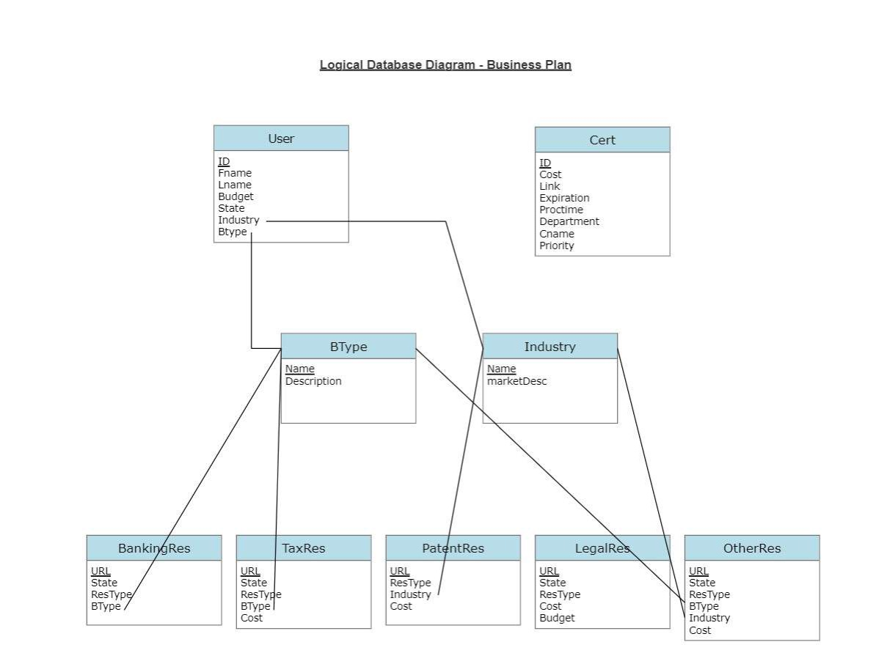

# Database Final
By: Emma, Bo, Shane, and Atticus

# Instructions:
Make sure you are in the correct file, then type python main.py

Simply follow the instructions that you are prompted with after that

# Sources: 
        
Embedded SQL Slides from Pete

https://www.geeksforgeeks.org/python-store-function-as-dictionary-value/

# Other Documentation
Docs: https://docs.google.com/document/d/1NNAMAdAtVfjAkM6G_WcwD52_2rKjVHHtrSTrnQiGNl8/edit?usp=sharing

Slides: https://docs.google.com/presentation/d/1YRQvH-07ImjbgjelX9pQQuQB9BSnzf3duAHEjrPPb2o/edit?usp=sharing

Raw Data: https://docs.google.com/spreadsheets/d/1m0551n3hkoDfBQ94P_bguVF32N7rM-CqFIrYLMXv9W4/edit?usp=sharing

UML:

Keys are underlined and foreign keys are connected with lines

Some Observations:
As you can see, the Cert table is not connected with any foreign keys. At the moment, this is because all of the certifications we had we not really unique to state or budget. This means that each cert is needed, and we couldn't really prune it based on other components of other tables.

Also, we do not have an other resources table in our database yet. This is something that we would like to do but did not have time to do research for yet. We planned to, but wanted to get the other parts working first.

         
